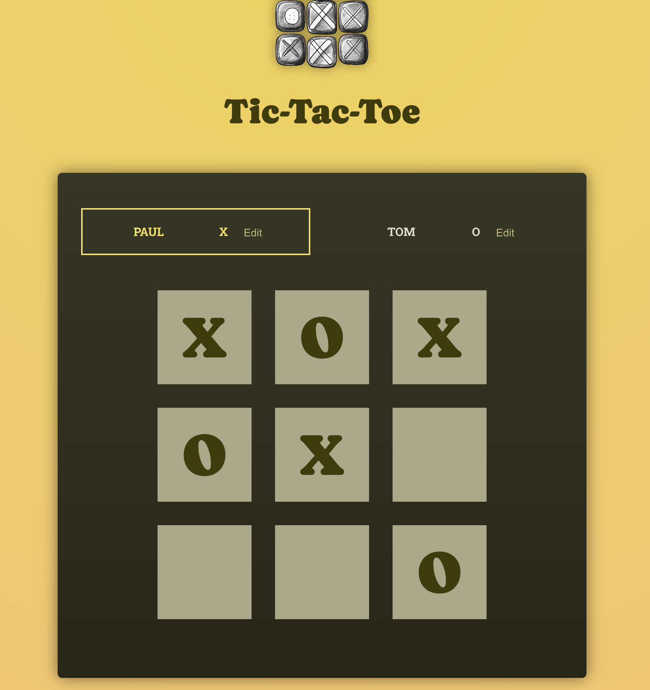

# App Overview

This Tic-Tac-Toe game is a good practice for diving deeper in React Core Concepts.
The game allows 2 players to play against each other on the gameboard. Each player can choose their player symbol "X" or "O" and set their name next to their chosen symbol.
When all the buttons on the gameboard are filled up with palyer symbols "X" or "O", the game will automatically dertermine a winner or a draw.

- Live URL (Hosted with Firebase): https://tic-tac-toe-reactjs-7a95f.web.app/

## User Story

A player plays the tic-tac-toe game using the online gameboard on a web browser with anohter player to find a winer or draw at the end of the game.

## Techniques applied

- Working with multiple JSX slots by passing JSX codes as props values
- Setting component type dynamically
- Setting default props value
- Updating state based on old state using the correct way -- Never mutate object/array
- Handling user input by using the 2-way binding technique
- Rendering multi-dimensional lists
- Lifting state to upper component
- Reducing state management & identifying unnecessary state
- Outsourcing data into a separate file

## Technologies Used

- React
- JavaScript
- HTML 5
- CSS
